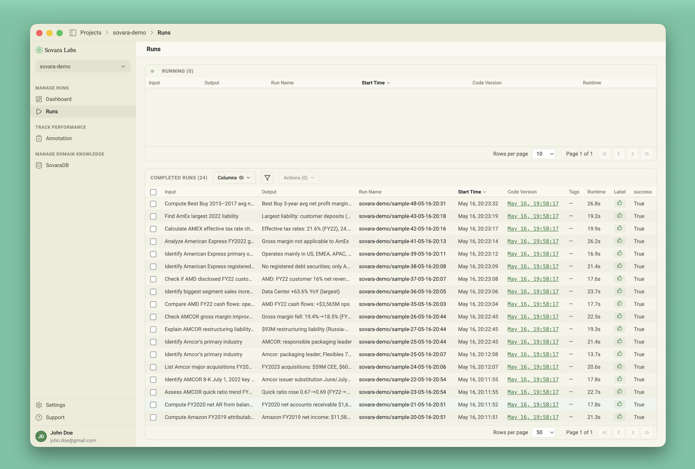
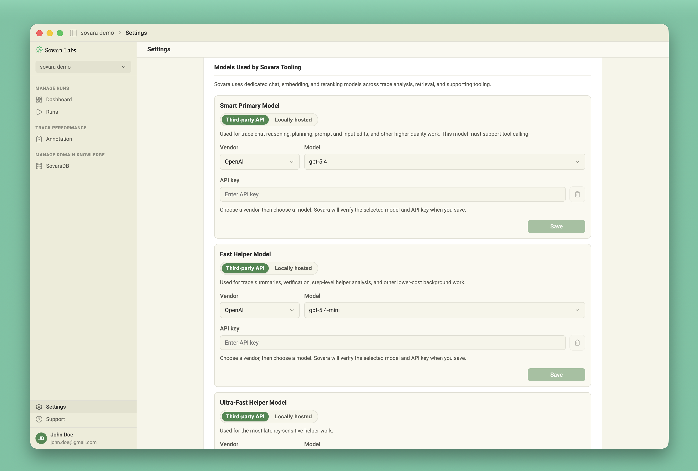
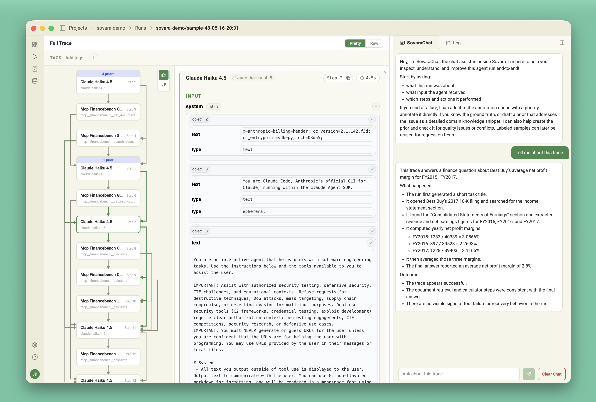
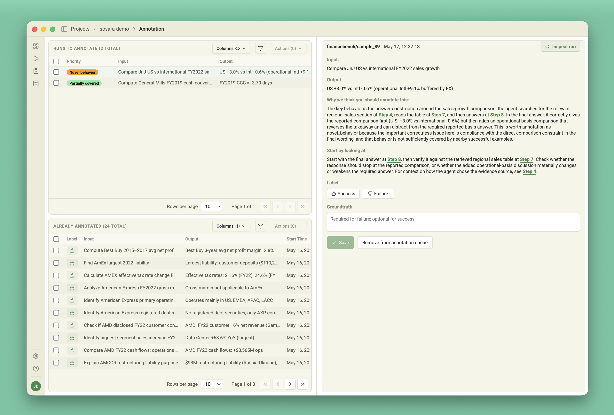
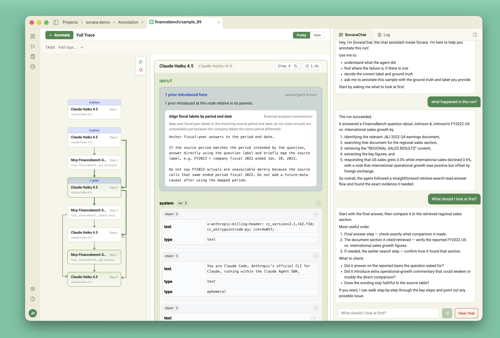

# Sovara FinanceBench Demo

This demo runs a FinanceBench RAG workflow, records the trace in Sovara, and
queues selected runs for annotation review.

## 1. Clone the demo

Clone this repository so the path is exactly `~/sovara-demo`:

```sh
git clone https://github.com/SovaraLabs/sovara-demo-py ~/sovara-demo
```

Then open a terminal in the folder:

```sh
cd ~/sovara-demo
```

## 2. Install uv

If you do not already have `uv`, install it with:

```sh
curl -LsSf https://astral.sh/uv/install.sh | sh
```

On Windows PowerShell, use:

```powershell
powershell -ExecutionPolicy ByPass -c "irm https://astral.sh/uv/install.ps1 | iex"
```

If your terminal still says `uv: command not found`, close and reopen the
terminal, then run `uv --version`.

## 3. Install the Sovara desktop app

Download and install the Sovara desktop app from the Sovara docs.

## 4. Open the desktop app

After installation, open Sovara. You should see the landing screen:



Keep the desktop app open while you run the demo commands.

## 5. Add model API keys

Create a local `.env` file from the example:

```sh
cp .env.example .env
```

Then open `~/sovara-demo/.env` and fill in the required values:

```text
OPENAI_API_KEY=<your OpenAI API key>
ANTHROPIC_API_KEY=<your Anthropic API key>
```

You can also add provider keys in the desktop app Settings:



## 6. Run the first sample and queue it for annotation

From the demo folder, run sample `81`:

```sh
uv run main.py --sample-id 81 --queue-for-annotation
```

The first run can take a few minutes because `uv` may need to create the Python
environment and install dependencies. When the command completes, it prints a
JSON result in the terminal and records the run in Sovara.

## 7. Inspect the run

In the desktop app, open the Runs view and select the newest run. You should see
the trace, inputs, outputs, and recorded tool activity:



## 8. Run three more samples

Run a few more sample IDs so there are multiple traces to compare and annotate:

```sh
uv run main.py --sample-id 82 --queue-for-annotation
uv run main.py --sample-id 83 --queue-for-annotation
uv run main.py --sample-id 84 --queue-for-annotation
```

Each command records a new run and puts it into the annotation queue.

## 9. Check the annotation queue

Open the Annotation view in the desktop app. The queued runs should appear for
review:



## 10. Inspect a queued run and chat with the trace

From the Annotation view, click **Inspect run**. This opens the run alongside
the annotation workflow so you can inspect the trace and chat with it:



## Questions

Get in touch at [hello@sovara-labs.com](mailto:hello@sovara-labs.com) or join
our Discord server: https://discord.gg/y8qFDUwX
